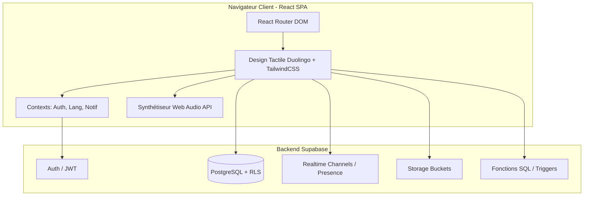

# 01 — Vue d'Ensemble (Produit & Technique)

## 1. Mission & Philosophie

**TerraCoast** est une plateforme web moderne dédiée à l'apprentissage de la géographie par le jeu et l'interaction sociale.

Sa philosophie repose sur quatre piliers :
1. **L'accessibilité totale** : gratuit, réactif sur mobile comme sur ordinateur, sans installation requise (compatible PWA).
2. **La gamification bienveillante** : design chaleureux inspiré de Duolingo, boutons tactiles 3D (`border-b-4`), micro-animations réjouissantes, séries quotidiennes (flammes) et absence de barrières punitives.
3. **La diversité pédagogique** : cartes vectorielles 2D, globes 3D interactifs, imagerie satellite, reconnaissance de silhouettes, comparaisons de données démographiques réelles (ONU/Banque Mondiale).
4. **La communauté & le partage** : création libre de quiz, duels asynchrones ou en direct, et salons multijoueurs grand écran pour les classes et soirées entre amis.

---

## 2. Périmètre Fonctionnel

### A. Quiz & Pédagogie
- **Éditeur de Quiz enrichi** : création de quiz personnalisés avec questions à choix unique, choix multiples, vrai/faux, saisie libre, puzzle sur carte interactive, remise en ordre Top 10 et questions multi-critères (nom, capitale, clic carte).
- **Parcours de Quêtes** : progression linéaire le long d'un sentier d'apprentissage géographique avec verrouillage/déblocage de paliers et étoiles de performance.
- **Révision ciblée** : module automatique de révision des erreurs commises à la fin d'une session.
- **Entraînement Zen (`/training`)** : catalogue complet de quiz jouables sans chronomètre pour apprendre à son rythme.
- **Répétition Espacée SRS (`/games/srs`)** : mémorisation à long terme basée sur le système de boîtes de Leitner avec flashcards interactives recto/verso.

### B. Hub des Jeux Géographiques (`/games`)
- **Geo Detective** : observation d'images satellites et de photos précises pour placer une épingle sur une carte zoomable.
- **Chrono Rush** : contre-la-montre de 45 secondes sous haute tension avec multiplicateurs de score et questions ultra-rapides.
- **Silhouette Mystère** : deviner un pays à partir de son contour vectoriel brut avec indices géodésiques (distance Haversine et boussole).
- **Higher or Lower** : jeu de cartes comparatif opposant populations ou superficies.
- **Map Blitz** : course contre la montre de localisation sur carte 2D.
- **Physical Geo** : défi sur les reliefs, fleuves, mers et déserts du globe.
- **Travle** : relier deux pays frontière par frontière avec le chemin le plus court.

### C. Duels 1v1 & Compétition (`/duels`)
- **Tour de jeu limpide** : affichage immédiat de l'état d'action (*C'est à toi de jouer !* vs *En attente du tour de l'adversaire*).
- **Matchmaking 1v1** :
  - **Mode Classé 🏆** : points MMR/ELO, classement compétitif.
  - **Mode Amical 🎮** : parties d'entraînement libres.
  - Interface radar animée avec critères de difficulté et sélection thématique ciblée.
- **Défis directs entre amis** : modal tactile avec recherche d'amis et de quiz.
- **Ghost Runs 👻** : défis asynchrones générant un lien partageable ou un QR code pour défier n'importe qui sur un temps record.

### D. Mode Salon Multijoueur / Party (`/party`)
- **Expérience collective façon Kahoot** : l'organisateur crée un salon public ou privé avec un code PIN à 6 chiffres.
- **Mode Grand Écran pour l'Hôte** : possibilité pour l'organisateur de ne pas être compté comme joueur afin de projeter uniquement le plateau de jeu sur rétroprojecteur ou téléviseur.
- **Prise en charge des quiz privés** : l'hôte peut sélectionner ses propres créations pour animer une session sur mesure.
- **Podium & Célébrations** : podium 3D, confettis et mode Battle Royale (élimination progressive).

### E. Atlas & Exploration (`/atlas`)
- **Visualisation 2D / 3D** : navigation fluide sur planisphère ou globe WebGL.
- **Fiches pays complètes** : populations certifiées (ONU/Banque Mondiale 2023), superficies, langues, capitales, monnaies et pays limitrophes cliquables.
- **Comparateur & TrueSize** : outil de superposition vectorielle pour apprécier la superficie réelle des pays sans distorsion cartographique.

### F. Gamification & Boutique (`/shop`)
- **Progression globale** : XP, niveaux de joueur, titres de prestige.
- **Flamme Quotidienne (Streaks 🔥)** : suivi du nombre de jours consécutifs avec calendrier hebdomadaire et bonus d'XP progressif.
- **Boutique cosmétique** : cadres d'avatars personnalisés et thèmes graphiques pour le globe 3D.
- **Ligues & Récompenses hebdomadaires** : distribution automatique de coffres et gemmes pour le Top 3 tous les dimanches soir à minuit.

### G. Administration & Gouvernance (`/admin`)
- **Tableau de bord & Analytics** : suivi de fréquentation avec filtres J-1, J-7, J-30 et graphiques multi-courbes.
- **Modération & Validation** : validation des quiz communautaires et géolocalisation inline des quiz orphelins.
- **Configuration Globale du Site** : gestion des bannières d'annonces, activation du mode maintenance et paramètres promotionnels.
- **Couverture Géographique** : matrice des pays couverts par des contenus pédagogiques.
- **Audit & Sécurité** : journalisation de toutes les actions d'administration via la fonction RPC `log_admin_event`.

---

## 3. Architecture Technique Simplifiée

- **Source de vérité backend** : `src/supabase/migrations/*.sql`
- **Contrats et typage** : `src/lib/database.types.ts`
- **Client unique** : `src/lib/supabase.ts`
