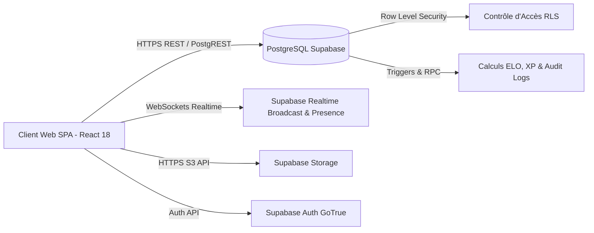

# 02 — Architecture Technique & Flux Système

## 1. Vue d'Ensemble Logique

**TerraCoast** fonctionne comme une Single Page Application (SPA) sans serveur applicatif Node.js/Express intermédiaire. Toute la logique serveur est déléguée aux primitives managées de **Supabase** :

---

## 2. Découpage du Frontend & Routage

L'application utilise **React Router DOM v6** avec un découpage dynamique par paquets (`code-splitting`) via un utilitaire de chargement résilient [`lazyWithRetry.ts`](file:///Users/fullann/Documents/GitHub/TerraCoast/src/lib/lazyWithRetry.ts) pour garantir une navigation instantanée et la tolérance aux pannes réseau ou redéploiements.

### Routes Majeures de l'Application

| Route | Composant | Description |
|---|---|---|
| `/` | `LandingPage` / `HomePage` | Accueil public si non-connecté, tableau de bord joueur et globe d'exploration si authentifié |
| `/login`, `/register` | `LoginForm`, `RegisterForm` | Authentification encapsulée dans `AuthLayout` (DA tactile) |
| `/duels` | `DuelsPage` | Arène 1v1, matchmaking radar, gestion des tours de jeu et Ghost Runs |
| `/party` | `PartyPage` | Salons multijoueurs façon Kahoot (lobby, écran hôte, live game, podium) |
| `/atlas` | `AtlasPage` | Planisphère 2D, globe 3D, fiches pays et comparateur TrueSize |
| `/games` | `GamesHubPage` | Hub des 7+ mini-jeux géographiques dédiés |
| `/games/*` | Pages jeux spécifiques | Geo Detective, Chrono Rush, Silhouette, Higher/Lower, Map Blitz, Physical Geo, Travle, SRS |
| `/quizzes` | `QuizzesPage` | Catalogue communautaire des quiz avec filtres et recherche |
| `/quizzes/create`, `/edit/:id` | `CreateQuizPage`, `EditQuizPage` | Éditeur visuel complet de quiz |
| `/quizzes/play/:id` | `PlayQuizPage` | Moteur d'exécution des questions (QCM, texte, puzzle, Top 10, multi-champs) |
| `/training` | `TrainingModePage` | Mode entraînement zen sans chronomètre |
| `/shop` | `ShopPage` | Boutique de cosmétiques (cadres d'avatar, thèmes de globe) |
| `/leaderboard` | `LeaderboardPage` | Classements mensuels, ligues compétitives et podiums |
| `/admin/*` | `AdminPage` | Espace d'administration sous `AdminDashboardLayout` |

---

## 3. Architecture Multijoueur Temps Réel (Mode Party)

Le mode multijoueur (`/party`) repose sur les canaux temps réel de Supabase :

1. **Présence des Joueurs (`Presence Channel`)** :
   - Chaque participant s'inscrit au canal `party:{roomCode}` avec son pseudo et son avatar.
   - L'hôte reçoit les notifications d'arrivée et de déconnexion en direct pour animer la salle d'attente.
2. **Diffusion d'Événements (`Broadcast Events`)** :
   - `START_GAME` : transmission de l'état de démarrage par l'hôte.
   - `NEW_QUESTION` : envoi de la question actuelle et du compte à rebours synchronisé.
   - `SUBMIT_ANSWER` : envoi chiffré des réponses des participants.
   - `ROUND_REVEAL` : révélation des résultats et du classement intermédiaire.
   - `FINAL_PODIUM` : affichage du podium final et déclenchement des confettis.
3. **Mode Hôte Écran Seul** :
   - L'état de l'hôte possède un drapeau `isSpectatorOnly = true`.
   - Il diffuse les questions et orchestre le jeu sans être enregistré dans la liste des scores participants, idéal pour projeter sur rétroprojecteur de classe ou écran de salon.

---

## 4. Moteur Audio & Retour Haptique

Pour éviter les temps de chargement et le poids des fichiers audio externes :
- **Synthétiseur Web Audio API natif** (`src/lib/soundManager.ts`) :
  - Génération algorithmique d'ondes sinusoïdales et de filtres harmoniques.
  - Tonalités pour les bonnes réponses (arpège ascendant majeur), mauvaises réponses (accord dissonant amorti), tic-tac d'urgence et fanfare de victoire.
- **Support Haptique** :
  - Déclenchement de micro-vibrations sur appareils compatibles (`navigator.vibrate`) pour un feedback tactile physique immédiat.

---

## 5. Gestion des Données & Sécurité

1. **Row Level Security (RLS)** :
   - Chaque table PostgreSQL possède des règles strictes `USING` et `WITH CHECK`.
   - Les profils des utilisateurs ne sont modifiables que par leur propriétaire ou par un administrateur.
   - Les quiz en attente de modération (`status = 'pending'`) ne sont visibles que par leur auteur et les administrateurs.
2. **Fonctions RPC SQL Sécurisées** :
   - Calcul des classements et attributions des points ELO/MMR.
   - Journalisation administrative inviolable via `log_admin_event()`.
