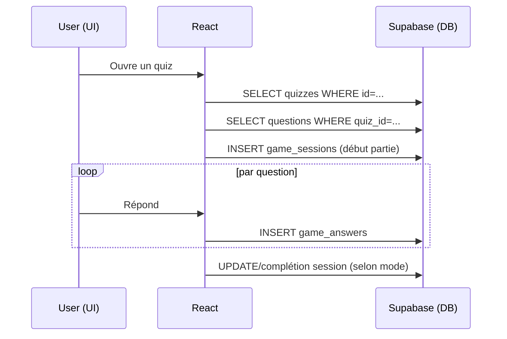
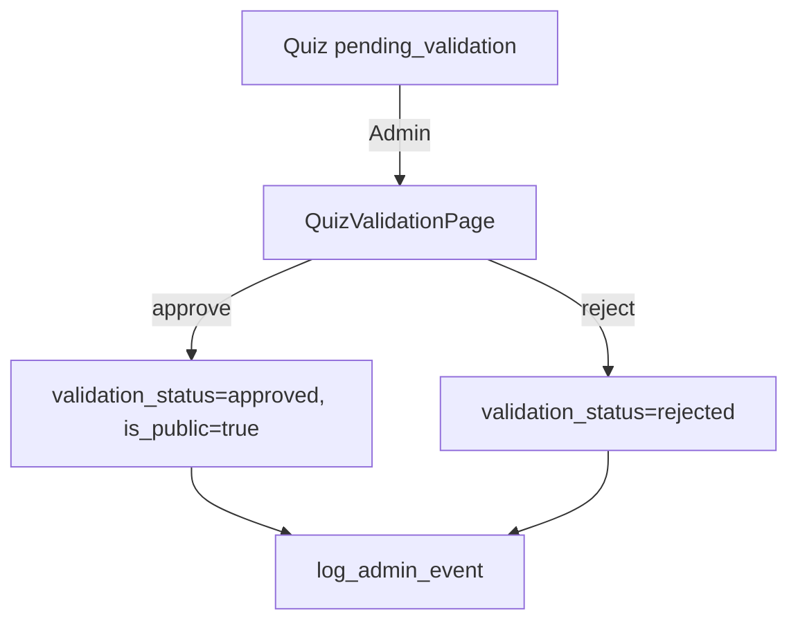
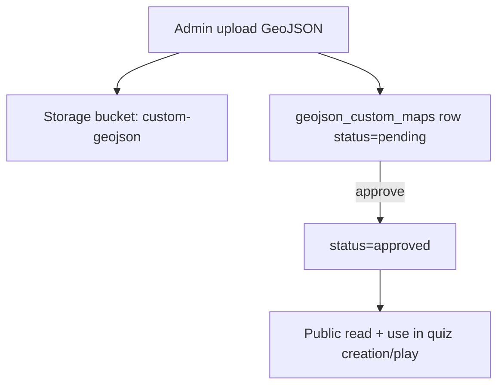
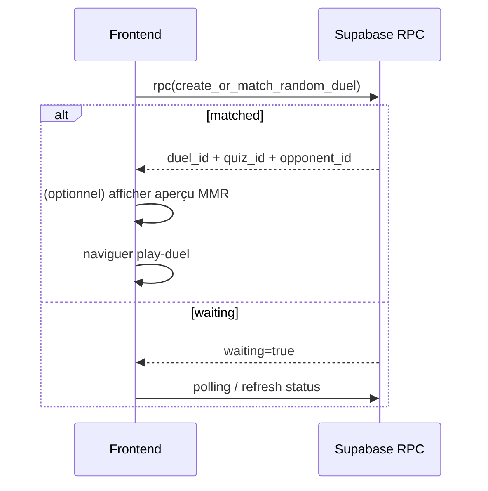

# 13 — Diagrammes (Mermaid)

## Architecture globale

```mermaid
flowchart LR
  UI[React + TS (Vite)] -->|supabase-js| SB[Supabase]
  SB --> AUTH[Auth]
  SB --> DB[Postgres + RLS]
  SB --> RPC[RPC SQL + Triggers]
  SB --> ST[Storage]
```

## Parcours “jouer un quiz”



## Workflow “validation quiz” (admin)



## Workflow “geojson custom maps”



## Matchmaking/duels (vue très simplifiée)



